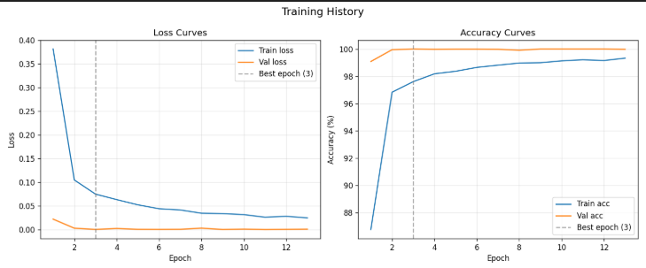

# Handwritten Digit Recognition

A PyTorch-based convolutional neural network (CNN) for handwritten digit recognition, featuring an interactive desktop UI for real-time inference.

# Features

- Real-time inference via drawing canvas, webcam, and image upload.
- Multi-digit sequence recognition.
- Built-in confidence thresholding (>80%) to filter noise and invalid inputs.
- Data processing pipeline for custom dataset augmentation and splitting.
- Dataset augmented from around 1,000 original samples to 52,000 variations by applying random tilts of ±25 degrees on its axis.

# Installation

Requires Python 3.8 or higher.

Install the dependencies:
```bash
pip install torch torchvision opencv-python Pillow numpy
```

# Usage

Launch the desktop interface:
```bash
python -m ui.main_app
```

*Global Shortcuts:*
- `Ctrl+S` / `Return`: Run prediction
- `Ctrl+Z`: Undo last stroke
- `Ctrl+O`: Upload image
- `Delete` / `Backspace`: Clear input
- `Ctrl+Q`: Quit

# Project Structure

```text
Digits_Recognition/
├── data/
├── images/
├── inference/
│   ├── predictor.py
│   ├── preprocessor.py
│   └── webcam_stream.py
├── models/
│   └── cnn_model.py
├── training/
│   ├── augmentation.py
│   ├── dataset_loader.py
│   ├── metrics.py
│   └── trainer.py
├── ui/
│   ├── canvas_panel.py
│   ├── main_app.py
│   ├── result_display.py
│   ├── upload_panel.py
│   └── webcam_panel.py
├── utils/
│   ├── logger.py
│   └── visualizer.py
├── augment_data.py
├── evaluate.py
├── prepare_dataset.py
├── requirements.txt
├── train.py
└── README.md
```

# Training

To train the model on a custom dataset:
1. Place source images in `data/raw/` or `data/augmented/`.
2. Generate the train/validation splits:
   ```bash
   python prepare_dataset.py
   ```
3. Run the training module to compute metrics and save checkpoint weights.

# Evaluation Results

### Training Curves



*The model learns quickly and effectively, reaching over 99% training accuracy and nearly 100% validation accuracy without any signs of overfitting.*

### Confusion Matrix


*As the matrix shows, the model does an excellent job distinguishing between the 10 digits, making almost no mistakes across the board.*
