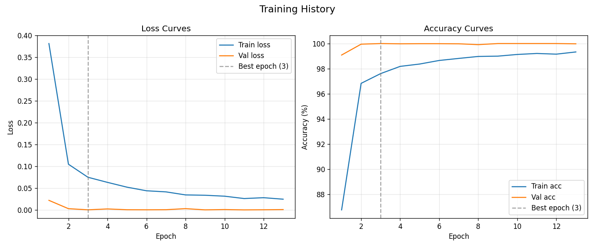
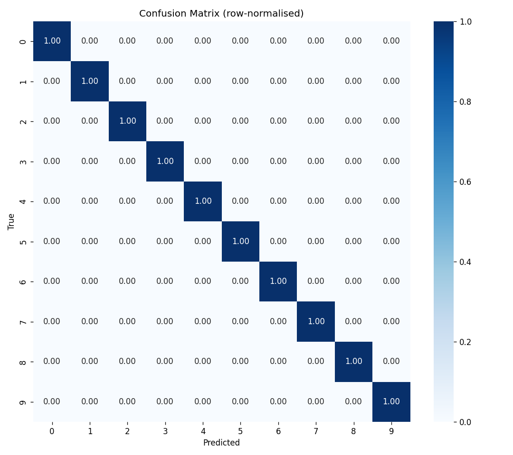

# Handwritten Digit Recognition

A PyTorch-based convolutional neural network (CNN) for handwritten digit recognition, featuring an interactive desktop UI for real-time inference.

# Features

- Real-time inference via drawing canvas, webcam, and image upload.
- Multi-digit sequence recognition.
- Built-in confidence thresholding (>80%) to filter noise and invalid inputs.
- Data processing pipeline for custom dataset augmentation and splitting.
- Dataset augmented from around 1,000 original samples to 52,000 variations by applying random tilts of ±25 degrees on its axis.

# Installation

Requires Python 3.8 or higher.

Install the dependencies:
```bash
pip install torch torchvision opencv-python Pillow numpy
```

# Usage

Launch the desktop interface:
```bash
python -m ui.main_app
```

*Global Shortcuts:*
- `Ctrl+S` / `Return`: Run prediction
- `Ctrl+Z`: Undo last stroke
- `Ctrl+O`: Upload image
- `Delete` / `Backspace`: Clear input
- `Ctrl+Q`: Quit

# Project Structure

- `ui/`: Tkinter interface components.
- `inference/`: PyTorch model loading and prediction logic.
- `training/`: CNN architecture, metrics, and training loops.
- `data/`: Target directories for `raw`, `augmented`, and `dataset` splits.

# Training

To train the model on a custom dataset:
1. Place source images in `data/raw/` or `data/augmented/`.
2. Generate the train/validation splits:
   ```bash
   python prepare_dataset.py
   ```
3. Run the training module to compute metrics and save checkpoint weights.

# Evaluation Results

### Training Curves

*The training curves show that the model converges quickly, achieving over 99% training accuracy and near 100% validation accuracy, indicating excellent performance without overfitting.*

### Confusion Matrix

*The confusion matrix confirms this high accuracy, showing near-perfect classification across all handwritten digit classes with virtually no misclassifications.*
