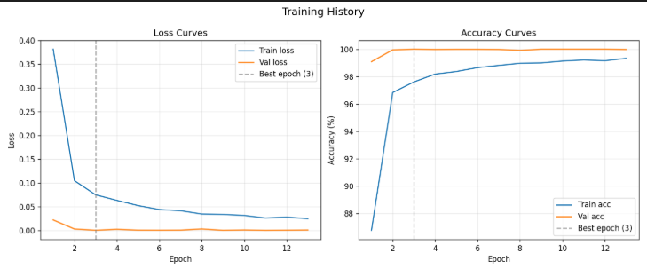
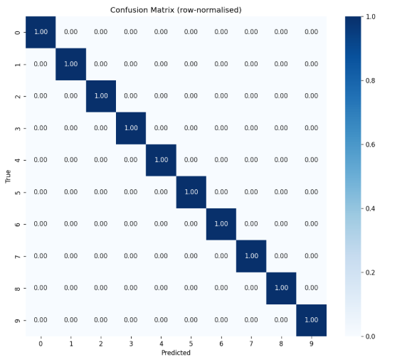

# Handwritten Digit Recognition

A PyTorch-based CNN for recognizing handwritten digits (0–9), with an interactive desktop UI for real-time inference via drawing, webcam, and image upload.

## Features

- **Drawing canvas** — draw digits directly and get instant predictions.
- **Webcam input** — recognize digits from a live camera feed.
- **Image upload** — load and classify digit images from disk.
- **Multi-digit recognition** — detects and classifies sequences of digits.
- **Confidence filtering** — predictions below a configurable threshold are discarded.
- **Uncertainty detection** — flags ambiguous predictions using margin and entropy analysis.
- **Data augmentation** — expanded ~1,000 samples to ~52,000 using ±25° rotations, brightness jitter, and elastic deformation.

## Model Architecture

The model (`DigitCNN`) is an optimized CNN designed for 17×43 grayscale digit images:

| Component | Description |
|---|---|
| **Input** | `[B, 1, 43, 17]` — grayscale images |
| **Conv Blocks** | 3 blocks with Conv2d → BatchNorm → ReLU → SE Attention → MaxPool |
| **Residual Connections** | After blocks 1 and 2 for better gradient flow |
| **SE Attention** | Squeeze-and-Excitation channel attention after each conv block |
| **Pooling** | Global Average Pooling (replaces heavy FC layers, ~90% fewer params) |
| **Classifier** | Dropout → Linear(128, 10) |
| **Output** | Raw logits `[B, 10]` |

Key design choices:
- **Bias-free Conv2d** layers before BatchNorm (redundant bias is absorbed).
- **Kaiming initialization** for Conv layers, Xavier for Linear layers.
- **~100K parameters** — lightweight enough for real-time CPU inference.

## Installation

Requires **Python 3.10+** and PyTorch 2.0+.

```bash
pip install -r requirements.txt
```

## Usage

Launch the desktop app:

```bash
python -m ui.main_app
```

**Keyboard Shortcuts:**

| Shortcut | Action |
|---|---|
| `Ctrl+S` / `Enter` | Run prediction |
| `Ctrl+Z` | Undo last stroke |
| `Ctrl+O` | Upload image |
| `Delete` / `Backspace` | Clear input |
| `Ctrl+Q` | Quit |

## Training

1. Place source images in `data/raw/` or `data/augmented/`.
2. Generate train/validation splits:
   ```bash
   python prepare_dataset.py
   ```
3. Augment the dataset (optional — supports rotation, brightness jitter, elastic deformation):
   ```bash
   python augment_data.py --brightness_jitter 0.15 --elastic
   ```
4. Train the model:
   ```bash
   python train.py --epochs 50 --lr 1e-3 --mixup_alpha 0.2
   ```
5. Evaluate performance:
   ```bash
   python evaluate.py --checkpoint models/checkpoints/best_model.pth
   ```

## Model Export

Export the trained model for deployment:

```bash
python export_model.py --checkpoint models/checkpoints/best_model.pth
```

Supports exporting to:
- **TorchScript** (`.pt`) — for C++ or mobile deployment
- **ONNX** (`.onnx`) — for cross-framework interoperability

## Evaluation Metrics

The evaluation pipeline computes a comprehensive set of metrics:

| Metric | Description |
|---|---|
| **Accuracy** | Overall correct predictions / total samples |
| **Precision / Recall / F1** | Macro and weighted averages across all 10 classes |
| **Cohen's Kappa** | Agreement beyond chance — robust to class imbalance |
| **MCC** | Matthews Correlation Coefficient — balanced binary/multiclass metric |
| **Top-K Accuracy** | Whether the true label is in the top 3 or 5 predictions |
| **Per-class F1** | Individual F1 score for each digit (0–9) |

## Project Structure

```
Digits_Recognition/
├── data/                   # Raw and processed datasets
├── images/                 # Training curves, confusion matrix
├── inference/              # Prediction and preprocessing logic
│   ├── predictor.py        # Single/batch prediction with uncertainty detection
│   ├── preprocessor.py     # Image normalization and cropping pipeline
│   └── webcam_stream.py    # Live camera digit recognition
├── models/                 # CNN architecture and saved checkpoints
│   ├── cnn_model.py        # DigitCNN with SE blocks and residual connections
│   └── checkpoints/        # Saved model weights
├── training/               # Training pipeline
│   ├── augmentation.py     # Runtime augmentation transforms
│   ├── dataset_loader.py   # Dataset loading with class weight computation
│   ├── metrics.py          # Comprehensive metrics (MCC, Kappa, per-class F1)
│   └── trainer.py          # Training loop with mixup, early stopping, timing
├── ui/                     # Desktop interface (Tkinter)
│   ├── main_app.py
│   ├── canvas_panel.py
│   ├── result_display.py
│   ├── upload_panel.py
│   └── webcam_panel.py
├── utils/                  # Logging and visualization helpers
│   ├── logger.py           # Rotating file logger with timer context manager
│   └── visualizer.py       # Training curves, confusion matrix, sample predictions
├── augment_data.py         # Standalone augmentation script
├── evaluate.py             # Model evaluation script
├── export_model.py         # Model export (TorchScript / ONNX)
├── prepare_dataset.py      # Dataset split script
├── train.py                # Training entry point
└── requirements.txt
```

## Results

### Training Curves



*The model reaches over 99% training accuracy and nearly 100% validation accuracy with no signs of overfitting.*

### Confusion Matrix



*Near-perfect classification across all 10 digits with minimal misclassifications.*